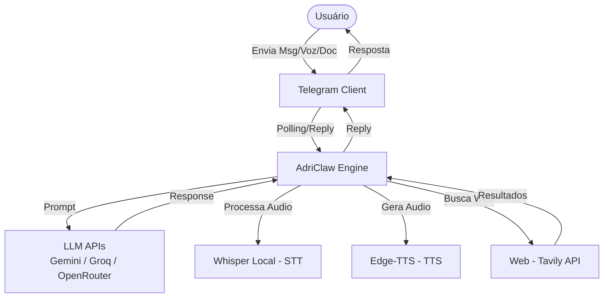
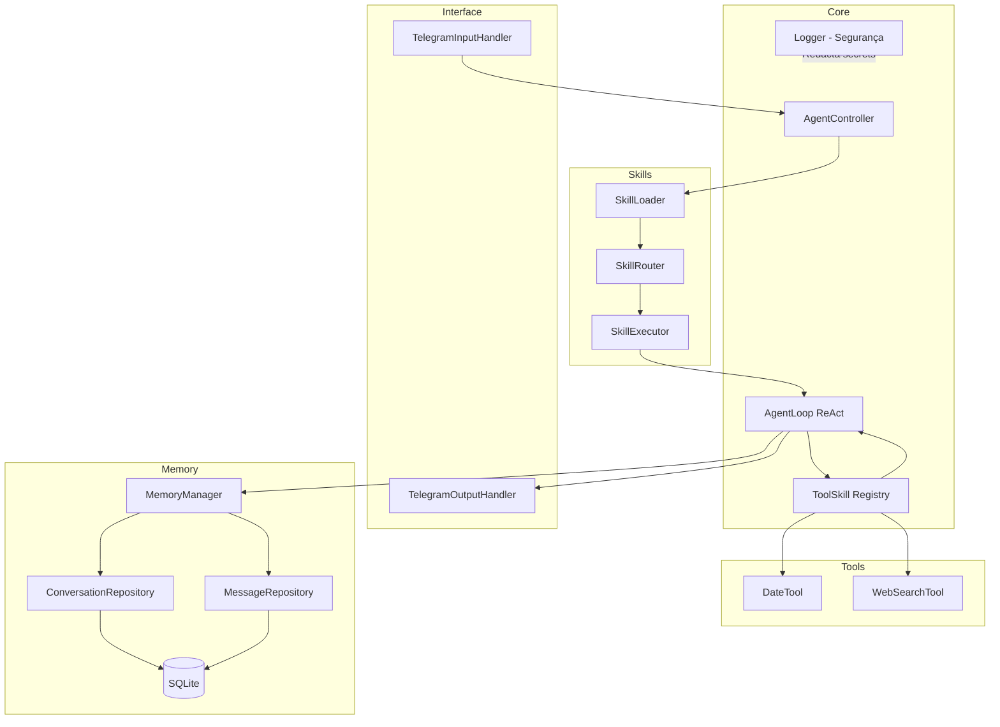
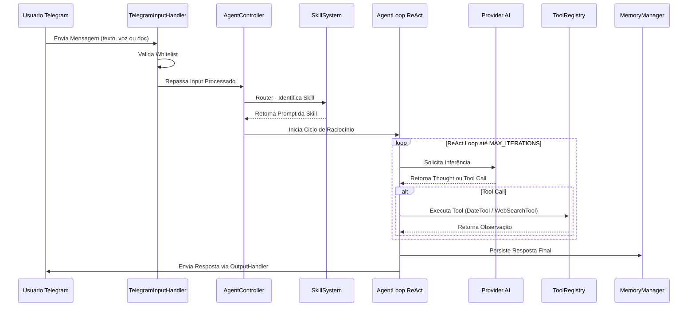

# 🤖 AdriClaw — Agente de IA Pessoal via Telegram

[](https://nodejs.org/)
[](https://www.typescriptlang.org/)
[](https://grammy.dev/)
[](https://github.com/WiseLibs/better-sqlite3)
[](https://opensource.org/licenses/ISC)

> **AdriClaw** é um agente pessoal de Inteligência Artificial que opera **100% localmente** no seu desktop Windows. Ele recebe comandos exclusivamente pelo **Telegram**, processa-os com múltiplos LLMs (Gemini, Groq, OpenRouter), suporta entradas em texto, PDF, Markdown e voz, **busca informações em tempo real na web** e responde de forma inteligente — tudo isso com dados e privacidade sob seu controle total.

---

## ✨ Funcionalidades Principais

- 💬 **Interface via Telegram** — Toda interação acontece por DM no Telegram. Sem UI web.
- 🧠 **Motor ReAct (Reasoning + Acting)** — Loop de raciocínio iterativo com suporte a chamada de ferramentas (Tool Calls).
- 🔄 **Multi-LLM Dinâmico** — Troca de provedores de IA (Gemini, Groq, OpenRouter) via configuração.
- 🛡️ **Fallback de LLM** — Mecanismo automático de comutação para Gemini caso o provedor primário falhe, garantindo disponibilidade.
- 🔌 **Skills por Hot-Reload** — Adicione ou atualize habilidades apenas colocando arquivos `.md` na pasta `.agents/skills/`, sem reiniciar o processo.
- 🌐 **Busca na Web em Tempo Real** — Acessa a internet via Tavily API para responder com informações atualizadas (notícias, preços, eventos, etc.).
- 📄 **Entradas Multimodais** — Aceita texto, arquivos PDF, Markdown e mensagens de voz (transcritas localmente via Whisper).
- 🔊 **Respostas em Áudio (TTS)** — Responde em voz com `pt-BR-ThalitaMultilingualNeural` via Edge-TTS quando solicitado.
- 💾 **Memória Persistente (SQLite)** — Histórico de conversas persistido localmente, com janela de contexto inteligente.
- 🔐 **Acesso Restrito por Whitelist** — Apenas usuários com ID autorizado no `.env` têm acesso ao agente.
- 📋 **Log de Segurança** — Sistema de logs com redação automática de dados sensíveis (tokens, chaves de API, caminhos do sistema).

---

## 🛠️ Stack de Tecnologia

| Componente | Tecnologia | Versão |
|---|---|---|
| **Linguagem** | TypeScript (Node.js) | `^5.9.3` |
| **Runtime** | tsx (dev) / Node.js | `^4.21.0` / `v20+ LTS` |
| **Interface Telegram** | grammy | `^1.41.1` |
| **Banco de Dados** | SQLite (`better-sqlite3`) | `^12.8.0` |
| **Parsing de PDF** | pdf-parse | `^2.4.5` |
| **Parsing de YAML** | js-yaml | `^4.1.1` |
| **LLMs Suportados** | Gemini, Groq, OpenRouter | via API |
| **Busca na Web** | Tavily API | via API REST |
| **STT (Voz para Texto)** | Whisper Local | — |
| **TTS (Texto para Voz)** | Microsoft Edge-TTS | `pt-BR-ThalitaMultilingualNeural` |
| **Paradigma** | Orientação a Objetos + Design Patterns | — |

---

## 🏗️ Arquitetura

O AdriClaw adota um estilo **Monolito Modular com Sistema de Plugins**, garantindo baixa latência, fácil manutenção e extensibilidade via skills e tools.

### Diagrama de Contexto

O Diagrama de Contexto mostra o sistema como um todo e como ele se comunica com o mundo externo — usuário, Telegram, LLMs, Whisper, Edge-TTS e a Web.



### Diagrama de Componentes

O Diagrama de Componentes abre o sistema por dentro, revelando como suas camadas e módulos estão organizados e interligados.



### Fluxo de Processamento de Mensagem



### Design Patterns Utilizados

| Pattern | Onde é aplicado |
|---|---|
| **Facade** | `AgentController`, `MemoryManager` |
| **Factory** | `ProviderFactory` (LLMs) |
| **Repository** | `ConversationRepository`, `MessageRepository` |
| **Singleton** | Conexão com o banco de dados SQLite |
| **Strategy** | `TelegramOutputHandler` (texto, chunks, arquivo, áudio) |
| **Registry** | `ToolRegistry` — registro dinâmico de tools |
| **Template Method** | `BaseTool` — contrato abstrato para todas as ferramentas |

---

## 🚀 Getting Started

### Pré-requisitos

- [Node.js](https://nodejs.org/) **v20+ LTS**
- [Git](https://git-scm.com/)
- Conta no Telegram e um **Bot Token** (criado via [@BotFather](https://t.me/BotFather))
- Chave de API para **Gemini** e/ou **Groq** e/ou **OpenRouter**
- Chave de API **Tavily** para busca na web (gratuita em [app.tavily.com](https://app.tavily.com))
- (Opcional) [Whisper](https://github.com/openai/whisper) instalado localmente para transcrição de voz
- (Opcional) [FFmpeg](https://ffmpeg.org/) instalado no sistema para suporte a áudio

### Instalação

1. **Clone o repositório:**

   ```bash
   git clone https://github.com/Adriano1976/Agente_AdriClaw_Antigrevity.git
   cd Agente_AdriClaw_Antigrevity
   ```

2. **Instale as dependências:**

   ```bash
   npm install
   ```

3. **Configure as variáveis de ambiente:**

   ```bash
   cp .env.exemplo .env
   ```

   Edite o arquivo `.env` com suas credenciais:

   ```env
   # Telegram
   TELEGRAM_BOT_TOKEN=seu_token_aqui
   TELEGRAM_ALLOWED_USER_IDS=123456789,987654321

   # LLM Provider (gemini | groq | openrouter)
   DEFAULT_LLM_PROVIDER=gemini
   GEMINI_API_KEY=sua_chave_gemini
   GROQ_API_KEY=sua_chave_groq
   OPENROUTER_API_KEY=sua_chave_openrouter

   # Web Search — https://app.tavily.com (1.000 buscas/mês grátis)
   TAVILY_API_KEY=tvly-xxxxxxxxxxxxxxxx

   # Agent Config
   MAX_ITERATIONS=5
   MEMORY_WINDOW_SIZE=10
   ```

4. **Inicie o agente em modo de desenvolvimento:**

   ```bash
   npm run dev
   ```

### Scripts Disponíveis

| Comando | Descrição |
|---|---|
| `npm run dev` | Inicia o agente em modo de desenvolvimento (tsx watch) |
| `npm run build` | Compila o TypeScript para JavaScript em `./dist/` |
| `npm start` | Executa a versão compilada em produção |

---

## 📁 Estrutura do Projeto

```
AdriClaw/
├── .agents/
│   └── skills/             # 🔌 Plugins de Skills (Hot-Reload) — adicione pastas com SKILL.md
├── data/                   # 💾 Banco de dados SQLite (db.sqlite) — não versionado
├── dist/                   # 📦 Build compilado (gerado por `npm run build`)
├── logs/                   # 📋 Logs de erros com redação automática de dados sensíveis
├── specs/                  # 📋 Documentação de specs e PRDs do projeto
│   ├── PRD.md
│   ├── architecture.md
│   ├── agent-loop.md
│   ├── memory.md
│   ├── skill-user.md
│   ├── telegram-input.md
│   └── telegram-output.md
├── src/                    # 🧠 Código-fonte principal
│   ├── config/             # Configurações e variáveis de ambiente
│   ├── core/               # AgentController, AgentLoop (ReAct), Logger
│   ├── db/                 # Conexão com o SQLite (Singleton + WAL)
│   ├── memory/             # MemoryManager e Repositories
│   ├── providers/          # Provedores de LLM (Gemini, Groq, OpenRouter)
│   ├── repository/         # ConversationRepository, MessageRepository
│   ├── skills/             # SkillLoader, SkillRouter, SkillExecutor
│   ├── telegram/           # TelegramInputHandler, TelegramOutputHandler
│   ├── tools/              # BaseTool, ToolRegistry, DateTool, WebSearchTool
│   └── index.ts            # Ponto de entrada da aplicação
├── tmp/                    # Arquivos temporários (PDFs, áudios) — auto-limpo
├── .env                    # Variáveis de ambiente (NÃO versionar)
├── .env.exemplo            # Exemplo de variáveis de ambiente
├── .gitignore
├── package.json
├── tsconfig.json
└── README.md
```

---

## 🔌 Sistema de Skills (Plugins)

O AdriClaw usa um sistema de plugins que permite adicionar habilidades ao agente **sem reiniciar** o processo.

### Como criar uma nova Skill

1. Crie uma nova pasta dentro de `.agents/skills/`:

   ```
   .agents/skills/minha-skill/
   └── SKILL.md
   ```

2. O `SKILL.md` deve começar com um frontmatter YAML:

   ```markdown
   ---
   name: minha-skill
   description: 'Descrição concisa do que essa skill faz, usada pelo Router LLM para seleção.'
   ---

   # Instruções da Skill

   Descreva aqui o comportamento detalhado que o agente deve seguir ao usar esta skill.
   ```

3. O `SkillLoader` detecta e carrega a skill automaticamente na próxima interação.

> O `SkillRouter` usa a `description` (frontmatter) para selecionar a skill correta com base na intenção do usuário via um "Passo Zero" neural — uma inferência leve que só injeta o conteúdo completo da skill quando ela é realmente necessária, economizando tokens em conversas simples.

---

## 🛠️ Sistema de Tools

Tools são ferramentas que o agente pode invocar durante o loop ReAct para executar ações reais no mundo. Toda tool herda de `BaseTool` e é registrada no `ToolRegistry`.

### Tools disponíveis

| Tool | Descrição |
|---|---|
| **`horario_local`** | Retorna a data e hora atual do sistema (com suporte a formato curto HH:MM) |
| **`web_search`** | Busca informações em tempo real na internet via Tavily API |

### Como a `web_search` funciona

Quando você envia uma pergunta que exige dados atuais (cotações, notícias, clima, etc.), o AgentLoop identifica automaticamente a necessidade e invoca a `web_search`:

1. O LLM raciocina que precisa de informação atualizada (Thought)
2. Invoca `web_search` com a query adequada (Action)
3. A Tavily API retorna resultados sintetizados (Observation)
4. O LLM formula a resposta final com base nos dados reais (Answer)

Exemplos de perguntas que ativam a busca:
- *"Qual o preço do dólar hoje?"*
- *"Últimas notícias sobre inteligência artificial"*
- *"Previsão do tempo para Aracaju amanhã"*

### Como criar uma nova Tool

```typescript
// src/tools/MinhaFerramentaTool.ts
import { BaseTool } from './BaseTool';

export class MinhaFerramentaTool extends BaseTool {
  name = 'minha_ferramenta';
  description = 'Descrição clara do que a ferramenta faz.';
  parameters = {
    type: 'object',
    properties: {
      parametro: { type: 'string', description: 'Descrição do parâmetro.' }
    },
    required: ['parametro']
  };

  async execute(args: { parametro: string }): Promise<string> {
    // Implemente a lógica aqui
    return `Resultado: ${args.parametro}`;
  }
}
```

Depois registre em `src/tools/index.ts`:

```typescript
import { MinhaFerramentaTool } from './MinhaFerramentaTool';
globalToolRegistry.register(new MinhaFerramentaTool());
```

---

## 🧩 Provedores de LLM

Os provedores são intercambiáveis via variável de ambiente `DEFAULT_LLM_PROVIDER`. O `ProviderFactory` instancia o provedor correto sem necessidade de alterar o código.

| Provedor | Variável de Env | Observações |
|---|---|---|
| Google Gemini | `GEMINI_API_KEY` | ✅ Provider padrão e de fallback |
| Groq | `GROQ_API_KEY` | ✅ Streaming nativo, auto-fix para role `tool` |
| OpenRouter | `OPENROUTER_API_KEY` | ✅ Acesso a múltiplos modelos via uma única API |

> Todos os providers implementam a interface `ILlmProvider` com o método `generate()`, garantindo intercambialidade total sem alteração do AgentLoop.

---

## 📥 Tipos de Input Suportados

| Tipo | Descrição |
|---|---|
| **Texto** | Mensagens de chat padrão via Telegram |
| **PDF** | Documentos `.pdf` — o conteúdo é extraído via `pdf-parse` e processado |
| **Markdown** | Arquivos `.md` — lidos como texto puro |
| **Voz / Áudio** | Mensagens de voz e áudios transcritos localmente via Whisper |

> Envios de imagens, DOCX, XLS e outros formatos não suportados retornam uma mensagem de aviso ao usuário.

---

## 📤 Estratégias de Output

O `TelegramOutputHandler` implementa o padrão **Strategy** para escolher a melhor forma de responder:

| Estratégia | Quando é usada |
|---|---|
| **TextOutputStrategy** | Respostas de texto (fragmentadas em chunks de 4.000 chars com respeito a palavras) |
| **FileOutputStrategy** | Quando a resposta é um documento `.md` (enviado como arquivo anexo) |
| **AudioOutputStrategy** | Quando `isAudio: true` — sintetiza voz via Edge-TTS e envia como Voice Note |
| **ErrorOutputStrategy** | Formata e envia avisos de erro com emoji `⚠️` |

---

## 🔐 Segurança

- **Whitelist estrita** baseada em `TELEGRAM_ALLOWED_USER_IDS` no `.env` — usuários não cadastrados são ignorados silenciosamente.
- **Processamento local** — áudios e documentos são processados na máquina local; apenas inferências e buscas web trafegam por APIs externas.
- **Sem secrets em logs** — o `Logger` redige automaticamente tokens, chaves de API e caminhos do usuário antes de gravar em arquivo.
- **Arquivos temporários** deletados após uso via bloco `finally` no tratamento de exceções.
- **Banco de dados** nunca versionado (`.gitignore` configurado para `data/`).

---

## 💾 Modelo de Dados (SQLite)

O banco de dados é criado automaticamente no caminho `./data/db.sqlite` no primeiro start, com WAL (Write-Ahead Logging) habilitado para performance.

```sql
-- Conversas por usuário
conversations (
  id       TEXT PRIMARY KEY,  -- ID único da thread (ex: "telegram_123456")
  user_id  TEXT NOT NULL,     -- ID do usuário Telegram (whitelisted)
  provider TEXT NOT NULL      -- ex: 'gemini'
)

-- Mensagens individuais
messages (
  id              INTEGER PRIMARY KEY AUTOINCREMENT,
  conversation_id TEXT NOT NULL,
  role            TEXT NOT NULL,  -- 'user' | 'assistant' | 'tool' | 'system'
  content         TEXT NOT NULL,
  created_at      DATETIME DEFAULT CURRENT_TIMESTAMP
)
```

> **Importante:** O arquivo `db.sqlite` e a pasta `data/` **nunca devem ser comitados** no Git (já configurado no `.gitignore`).

---

## 🤝 Contribuindo

Contribuições são bem-vindas! Para contribuir:

1. Faça um fork do repositório
2. Crie uma branch para sua feature: `git checkout -b feat/minha-feature`
3. Siga os padrões de código: **POO com Classes, Interfaces e Design Patterns** (sem funções soltas no core)
4. Garanta que novas Skills sejam documentadas com `SKILL.md` + frontmatter YAML válido
5. Toda nova Tool deve herdar de `BaseTool` e ser registrada no `ToolRegistry`
6. Abra um Pull Request descrevendo claramente a mudança

### Padrões de Código

- **TypeScript** com `strict: true` (definido em `tsconfig.json`)
- **Paradigma obrigatório:** Classes e Interfaces (Programação Orientada a Objetos)
- Toda nova ferramenta deve herdar de `BaseTool` e ser registrada no `ToolRegistry`
- Novos provedores de LLM devem implementar a interface `ILlmProvider`
- Variáveis de ambiente sensíveis **nunca** devem ser hardcodadas no código
- Arquivos temporários **sempre** devem ser deletados no bloco `finally`

---

## 📚 Documentação de Referência

Todos os documentos de especificação estão na pasta [`specs/`](./specs/):

| Documento | Descrição |
|---|---|
| [PRD.md](./specs/PRD.md) | Documento de Requisitos do Produto (visão geral e objetivos) |
| [architecture.md](./specs/architecture.md) | Arquitetura detalhada, diagramas e decisões de tecnologia |
| [agent-loop.md](./specs/agent-loop.md) | Especificação do Motor ReAct (AgentLoop) |
| [memory.md](./specs/memory.md) | Especificação do Módulo de Memória (SQLite) |
| [skill-user.md](./specs/skill-user.md) | Especificação do Sistema de Skills (Hot-Reload) |
| [telegram-input.md](./specs/telegram-input.md) | Especificação do Módulo de Input do Telegram |
| [telegram-output.md](./specs/telegram-output.md) | Especificação do Módulo de Output do Telegram |

---

## 📄 Licença

Distribuído sob a licença **ISC**. Veja o arquivo `package.json` para detalhes.

<br>
<div align="center">
  <sub>Construído por Adriano · Powered by Gemini, Groq & OpenRouter · Interface via Telegram</sub>
</div>
<br>

---

<br>
<div align="center">
  <p><b><h3> Contagem de visitantes </h3></b></p>  
  
   <br>
  
</div>
